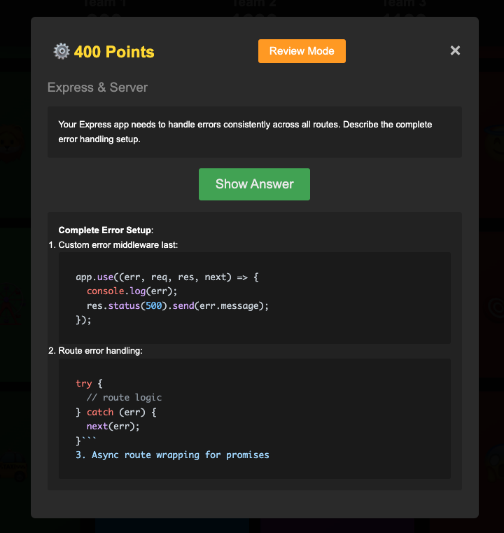

# Trivia Game App

A Jeopardy-style trivia game for reviewing full-stack development concepts, specifically tailored for coding bootcamp students.

## Features

- 🎯 Interactive quiz game with point-based scoring
- 🎨 Visual card system with unique emojis for easy reference
- 👥 Support for 3 teams with score tracking
- 📱 Fullscreen mode for classroom presentations
- 💡 Review mode for going back to previous questions
- ✨ Markdown support for code syntax highlighting
- 🔄 Randomized questions for replayability




## Setup

1. Clone the repository
```bash
git clone https://github.com/MaterDev/Primatif_TriviaGameApp.git
cd Primatif_TriviaGameApp
```

2. Open in browser
```bash
# Simply open src/index.html in your browser
# No server required - runs entirely in the browser
```

## Game Instructions

1. **Starting the Game**
   - Teams take turns selecting cards by their emoji
   - Each card is worth different points (100-400)
   - Questions get harder as point values increase

2. **Playing a Round**
   - Click a card to reveal the question
   - Use "Show Answer" when teams are ready to see the answer
   - Award or deduct points using the team buttons
   - Cards turn green/red based on correct/incorrect answers

3. **Controls**
   - `F` key or button to toggle fullscreen mode
   - `ESC` to close question modal
   - Review Mode button to revisit previous questions

## File Structure

```
src/
├── index.html          # Main game interface
├── styles.css          # Game styling
├── client.js           # Game logic
└── data/
    └── 01_react-express-sql-fullstack.js  # Question database
```

## Customization

To add or modify questions, edit the `triviaQuestions` array in `data/01_react-express-sql-fullstack.js`. Each question requires:

```javascript
{
    id: 'unique-id',
    category: CATEGORIES.CATEGORY_NAME,
    points: POINT_VALUES.DIFFICULTY,
    question: "Question text with optional markdown",
    answer: "Answer text with optional markdown",
    source: "Source document reference"
}
```

## Technologies Used

- Vanilla JavaScript
- CSS3
- HTML5
- Marked.js for Markdown rendering
- highlight.js for code syntax highlighting